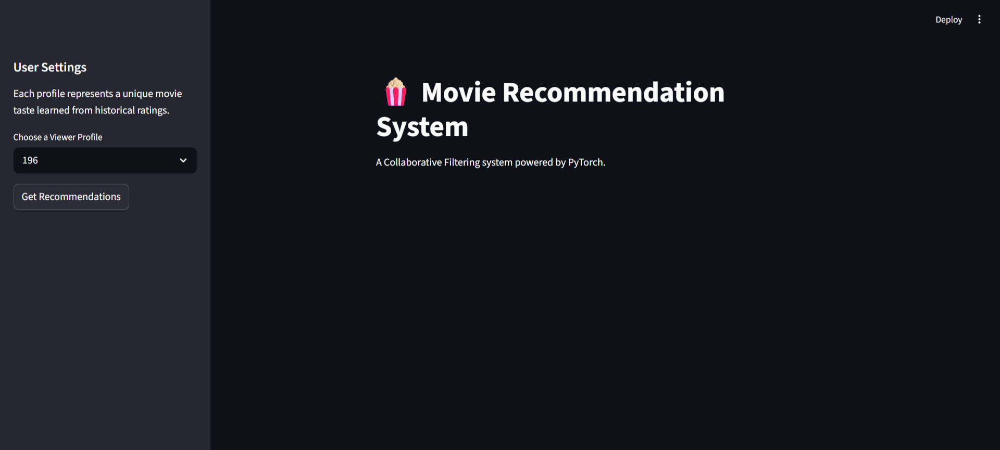
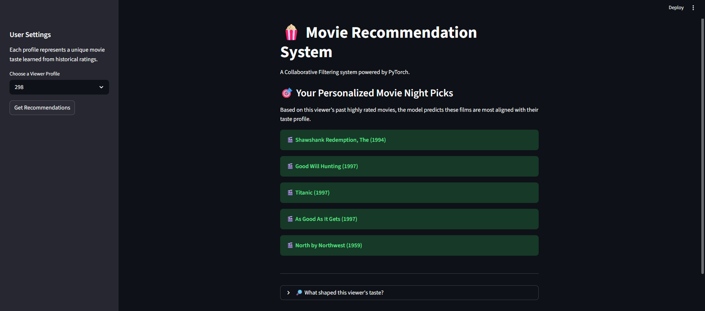
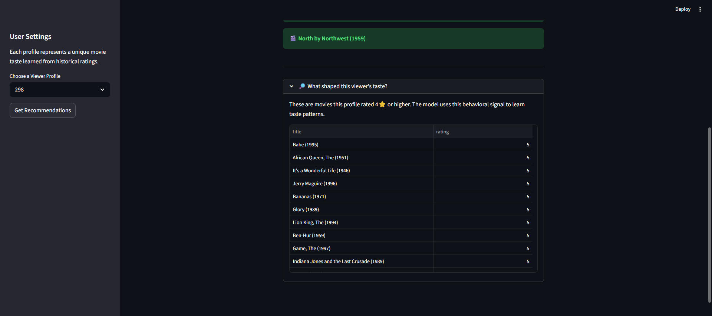

# 🍿 Movie Recommendation System  
### Neural Collaborative Filtering with PyTorch + Streamlit

---

## 🎬 Project Overview

Choosing a movie shouldn’t feel like scrolling endlessly.

This project implements a **Neural Collaborative Filtering** recommender system that learns user taste patterns from historical ratings and predicts which unseen movies a viewer is most likely to enjoy.

Instead of relying on genres or metadata, the model learns **latent behavioral representations** of users and movies using embeddings.

An interactive Streamlit application simulates real-world recommendation flow by allowing you to select a viewer profile and generate personalized movie suggestions instantly.

---

## 🧠 Core Idea

Every user has a unique rating behavior.

By learning embedding representations for:

- 👤 Users  
- 🎬 Movies  

the model captures hidden (latent) taste dimensions.

The system predicts how likely a user is to enjoy an unseen movie and recommends the Top-K highest predicted titles.

This mirrors how real streaming platforms use collaborative filtering to model user preferences.

---

## 🏗 Model Architecture

Implemented in **PyTorch**.

### Components:

- User Embedding Layer  
- Movie Embedding Layer  
- User Bias  
- Movie Bias  
- Dot-product interaction  

### Prediction Formula

```
score(user, movie) =
(dot(user_embedding, movie_embedding))
+ user_bias
+ movie_bias
```

### Configuration

- Embedding dimension: 50  
- Trained on MovieLens 100K dataset  
- Model weights saved and loaded for inference  

The model is serialized and reused in the Streamlit app without retraining.

---

## 📊 Dataset

This project uses the **MovieLens 100K dataset**, which contains:

- 100,000 ratings  
- User IDs  
- Movie IDs  
- Rating values  
- Timestamps  

No movie content features are used —  
this is a **pure collaborative filtering approach**.

---

## 🖥 Interactive Application

Built using **Streamlit**.

### How It Works:

1. Select a viewer profile (User ID).
2. The system identifies movies the user has not rated.
3. The model predicts scores for all unseen movies.
4. Top 5 highest-scoring movies are recommended.
5. You can expand a section to see movies that shaped this viewer’s taste (rated 4⭐ or higher).

Each User ID represents a unique behavioral fingerprint learned from rating history.

---

## 📸 App Preview

### Main Interface


### Generated Recommendations


### User Taste History


---

## 📂 Project Structure

```
movie-recommender/
│
├── data/
│   ├── u.data
│   └── u.item
│
├── models/
│   └── movie_recommender(final).pth
│
├── notebook/
│   └── movie-recommendations.ipynb
│
├── app.py
├── requirements.txt
└── README.md
```

### File Descriptions

- **movie-recommendations.ipynb**  
  Data preprocessing, model training, and evaluation.

- **app.py**  
  Streamlit inference application using saved model weights.

- **models/**  
  Contains trained PyTorch model parameters.

- **data/**  
  MovieLens dataset files.

---

## 🚀 How to Run

### 1️⃣ Install dependencies

```bash
pip install -r requirements.txt
```

### 2️⃣ Run the Streamlit app

```bash
streamlit run app.py
```

The application will open locally in your browser.

---

## ✨ Key Highlights

- Neural collaborative filtering implementation
- Learned user & movie embeddings
- Separation between training and inference
- Model serialization using PyTorch
- Efficient Top-K recommendation logic
- Interactive UI built with Streamlit
- Clean and modular project structure

---

## 🔮 Potential Improvements

- Hybrid filtering (combine collaborative + content features)
- Cold-start user handling
- User-driven rating input inside the app
- Deployment to cloud platform
- Add evaluation metrics dashboard (RMSE, MAE)

---

## 🤝 Contributing

Pull requests are welcome! Got a cool idea? Send it over.
